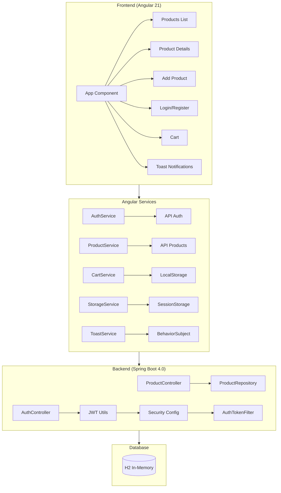
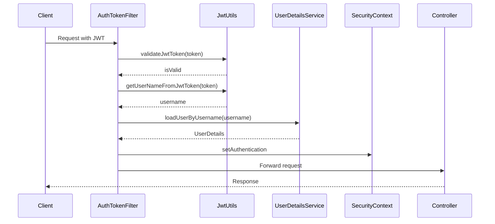
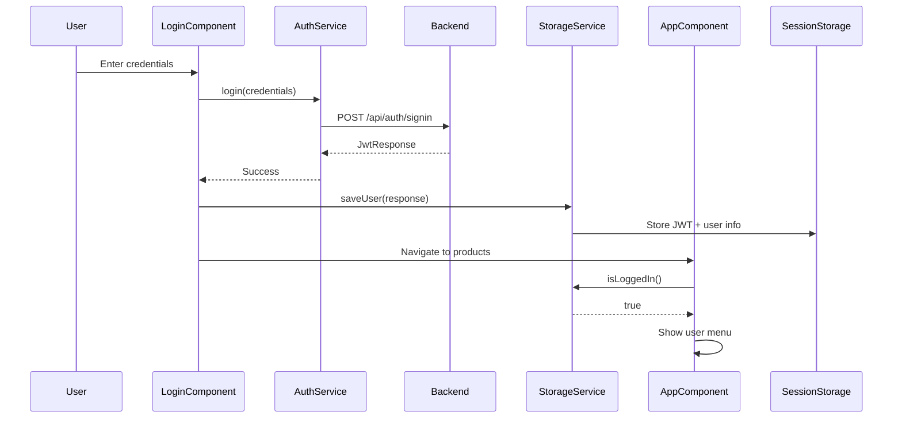
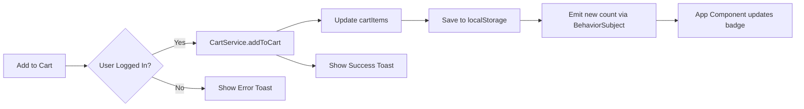

# TechStore Pro - Documentação Completa de Implementação

## Visão Geral do Projeto

**TechStore Pro** é uma aplicação de e-commerce profissional desenvolvida como projeto de portfólio, utilizando uma arquitetura full-stack moderna com **Spring Boot 4.0** no backend e **Angular 21** no frontend.



---

## Arquitetura Backend

### Stack Tecnológico

| Tecnologia | Versão | Propósito |
|------------|--------|-----------|
| Spring Boot | 4.0.0 | Framework principal |
| Java | 21 | Linguagem de programação |
| Spring Security | Latest | Autenticação e autorização |
| Spring Data JPA | Latest | Persistência de dados |
| H2 Database | Runtime | Banco de dados em memória |
| JWT (jjwt) | 0.11.5 | Tokens de autenticação |
| Lombok | Latest | Redução de boilerplate |
| Bean Validation | Latest | Validação de dados |

### Estrutura de Pacotes

```
com.exercice.crud01/
├── Crud01Application.java       # Entry point
├── config/
│   └── DataSeeder.java          # Inicialização de dados
├── controller/
│   ├── AuthController.java      # Endpoints de autenticação
│   └── ProductController.java   # CRUD de produtos
├── model/
│   ├── Product.java             # Entidade de produto
│   ├── User.java                # Entidade de usuário
│   └── Role.java                # Enum de papéis
├── payload/
│   ├── request/                 # DTOs de entrada
│   │   ├── LoginRequest.java
│   │   └── SignupRequest.java
│   └── response/                # DTOs de saída
│       ├── JwtResponse.java
│       └── MessageResponse.java
├── repository/
│   ├── ProductRepository.java   # Acesso a produtos
│   └── UserRepository.java      # Acesso a usuários
└── security/
    ├── WebSecurityConfig.java   # Configuração de segurança
    ├── jwt/
    │   ├── AuthEntryPointJwt.java
    │   ├── AuthTokenFilter.java
    │   └── JwtUtils.java
    └── services/
        ├── UserDetailsImpl.java
        └── UserDetailsServiceImpl.java
```

---

## Design Patterns Implementados

### 1. Repository Pattern

O projeto utiliza o padrão Repository através do Spring Data JPA para abstrair o acesso aos dados.

**Implementação:** [ProductRepository.java](file:///home/cristian/Documents/Codes/SpringBootApplications/crud01/spring-boot-server/src/main/java/com/exercice/crud01/repository/ProductRepository.java)

```java
public interface ProductRepository extends JpaRepository<Product, Long> {
    List<Product> findByNameContaining(String name);
    List<Product> findByDescriptionContaining(String description);
    List<Product> findByPriceLessThanEqual(Double price);
    List<Product> findByPriceGreaterThanEqual(Double price);
    
    @Query("SELECT p FROM Product p WHERE LOWER(p.name) LIKE LOWER(CONCAT('%', :text, '%')) " +
           "OR LOWER(p.description) LIKE LOWER(CONCAT('%', :text, '%')) " +
           "ORDER BY CASE WHEN LOWER(p.name) LIKE LOWER(CONCAT('%', :text, '%')) THEN 0 ELSE 1 END")
    List<Product> searchByTextAndRank(@Param("text") String text);
}
```

> [!TIP]
> O método `searchByTextAndRank` implementa busca inteligente com ranking, priorizando matches no nome sobre matches na descrição.

---

### 2. DTO Pattern (Data Transfer Objects)

DTOs são usados para transferir dados entre camadas, garantindo encapsulamento e segurança.

**Estrutura de Request/Response:**

````carousel
```java
// LoginRequest.java - DTO de entrada
@Data
public class LoginRequest {
    @NotBlank
    private String username;
    @NotBlank
    private String password;
}
```
<!-- slide -->
```java
// JwtResponse.java - DTO de saída
@Data
public class JwtResponse {
    private String token;
    private String type = "Bearer";
    private Long id;
    private String username;
    private String email;
    private List<String> roles;
}
```
````

---

### 3. Filter Chain Pattern (Security)

O fluxo de autenticação JWT utiliza o padrão Filter Chain do Spring Security.



**Implementação do Filtro:** [AuthTokenFilter.java](file:///home/cristian/Documents/Codes/SpringBootApplications/crud01/spring-boot-server/src/main/java/com/exercice/crud01/security/jwt/AuthTokenFilter.java)

```java
@Override
protected void doFilterInternal(HttpServletRequest request, HttpServletResponse response, 
                                FilterChain filterChain) throws ServletException, IOException {
    try {
        String jwt = parseJwt(request);
        if (jwt != null && jwtUtils.validateJwtToken(jwt)) {
            String username = jwtUtils.getUserNameFromJwtToken(jwt);
            UserDetails userDetails = userDetailsService.loadUserByUsername(username);
            UsernamePasswordAuthenticationToken authentication = 
                new UsernamePasswordAuthenticationToken(userDetails, null, userDetails.getAuthorities());
            SecurityContextHolder.getContext().setAuthentication(authentication);
        }
    } catch (Exception e) {
        logger.error("Cannot set user authentication: {}", e);
    }
    filterChain.doFilter(request, response);
}
```

---

### 4. Dependency Injection Pattern

O Spring Framework gerencia todas as dependências através de DI, garantindo baixo acoplamento.

**Exemplo no Controller:**
```java
@RestController
public class ProductController {
    @Autowired
    ProductRepository productRepository;  // Injeção automática
}
```

---

### 5. Builder Pattern (JWT Generation)

O `JwtUtils` utiliza o padrão Builder do JJWT para construir tokens.

```java
public String generateJwtToken(Authentication authentication) {
    UserDetailsImpl userPrincipal = (UserDetailsImpl) authentication.getPrincipal();
    
    return Jwts.builder()
            .setSubject((userPrincipal.getUsername()))
            .setIssuedAt(new Date())
            .setExpiration(new Date((new Date()).getTime() + jwtExpirationMs))
            .signWith(key(), SignatureAlgorithm.HS256)
            .compact();
}
```

---

## Estratégias de Segurança

### Configuração de Segurança

**Arquivo:** [WebSecurityConfig.java](file:///home/cristian/Documents/Codes/SpringBootApplications/crud01/spring-boot-server/src/main/java/com/exercice/crud01/security/WebSecurityConfig.java)

| Endpoint | Método | Acesso |
|----------|--------|--------|
| `/api/auth/**` | ALL | Público |
| `/api/products/**` | GET | Público |
| `/api/products/**` | POST/PUT/DELETE | Autenticado |
| `/api/test/**` | ALL | Público |
| Outros | ALL | Autenticado |

```java
http.csrf(csrf -> csrf.disable())
    .exceptionHandling(exception -> exception.authenticationEntryPoint(unauthorizedHandler))
    .sessionManagement(session -> session.sessionCreationPolicy(SessionCreationPolicy.STATELESS))
    .authorizeHttpRequests(auth -> auth
        .requestMatchers("/api/auth/**").permitAll()
        .requestMatchers(HttpMethod.GET, "/api/products/**").permitAll()
        .anyRequest().authenticated());
```

> [!IMPORTANT]
> A aplicação usa sessões **STATELESS** - cada request deve incluir o JWT no header `Authorization: Bearer <token>`.

### Sistema de Roles

```java
public enum Role {
    ROLE_USER,
    ROLE_ADMIN
}
```

---

## Arquitetura Frontend

### Stack Tecnológico

| Tecnologia | Versão | Propósito |
|------------|--------|-----------|
| Angular | 21.0.0 | Framework SPA |
| TypeScript | 5.9.2 | Linguagem |
| Bootstrap | 5.3.8 | Estilização |
| RxJS | 7.8.0 | Programação reativa |
| Zone.js | 0.16.0 | Change detection |

### Estrutura de Componentes

```
src/app/
├── app.ts                    # Componente raiz
├── app.config.ts             # Configuração da aplicação
├── app.routes.ts             # Configuração de rotas
├── components/
│   ├── add-product/          # Adicionar produto
│   ├── cart/                 # Carrinho de compras
│   ├── login/                # Autenticação
│   ├── product-details/      # Detalhes do produto
│   ├── products-list/        # Lista de produtos
│   ├── register/             # Registro de usuário
│   └── toast/                # Notificações
├── models/
│   └── product.model.ts      # Interface de produto
└── services/
    ├── auth.service.ts       # Autenticação
    ├── cart.service.ts       # Gerenciamento do carrinho
    ├── product.service.ts    # CRUD de produtos
    ├── storage.service.ts    # Armazenamento de sessão
    └── toast.service.ts      # Notificações toast
```

---

## Design Patterns no Frontend

### 1. Standalone Components

Angular 21 utiliza componentes standalone, eliminando a necessidade de NgModules.

```typescript
@Component({
    selector: 'app-products-list',
    standalone: true,
    imports: [CommonModule, FormsModule, ProductDetailsComponent],
    templateUrl: './products-list.component.html'
})
export class ProductsListComponent { }
```

---

### 2. Observable/BehaviorSubject Pattern

Gerenciamento de estado reativo usando RxJS.

**CartService - Estado do Carrinho:**

```typescript
export class CartService {
    private cartItems: any[] = [];
    private cartCount = new BehaviorSubject<number>(0);

    getCartCount() {
        return this.cartCount.asObservable();
    }

    addToCart(product: Product) {
        const existingItem = this.cartItems.find(item => item.id === product.id);
        if (existingItem) {
            existingItem.quantity += 1;
        } else {
            this.cartItems.push({ ...product, quantity: 1 });
        }
        this.saveCart();
        this.cartCount.next(this.calculateTotalCount());
    }
}
```

**ToastService - Notificações Reativas:**

```typescript
export class ToastService {
    private toasts: Toast[] = [];
    private toastsSubject = new BehaviorSubject<Toast[]>([]);

    show(message: string, type: 'success' | 'error' | 'info' = 'success') {
        const toast: Toast = { message, type, id: Date.now() };
        this.toasts.push(toast);
        this.toastsSubject.next(this.toasts);
        
        setTimeout(() => this.remove(toast.id), 3000);  // Auto-remove
    }
}
```

---

### 3. Service Pattern

Serviços injetáveis encapsulam lógica de negócio e comunicação HTTP.

```typescript
@Injectable({ providedIn: 'root' })
export class ProductService {
    constructor(private http: HttpClient) { }

    getAll(): Observable<Product[]> {
        return this.http.get<Product[]>(baseUrl);
    }

    create(data: any): Observable<any> {
        return this.http.post(baseUrl, data);
    }
}
```

---

### 4. Singleton Pattern (providedIn: 'root')

Todos os serviços são singletons globais, garantindo uma única instância.

```typescript
@Injectable({
    providedIn: 'root'  // Singleton em toda aplicação
})
export class StorageService { }
```

---

## Fluxo de Autenticação Completo



---

## Sistema de Carrinho (Client-Side)



> [!NOTE]
> O carrinho persiste no `localStorage`, sobrevivendo a reloads da página. O estado de autenticação usa `sessionStorage`.

---

## Configuração e Rotas

### Rotas Definidas

```typescript
export const routes: Routes = [
    { path: '', redirectTo: 'products', pathMatch: 'full' },
    { path: 'products', component: ProductsListComponent },
    { path: 'products/:id', component: ProductDetailsComponent },
    { path: 'add', component: AddProductComponent },
    { path: 'login', component: LoginComponent },
    { path: 'register', component: RegisterComponent },
    { path: 'cart', component: CartComponent }
];
```

### Configuração da Aplicação

```typescript
export const appConfig: ApplicationConfig = {
    providers: [
        provideZoneChangeDetection({ eventCoalescing: true }),
        provideRouter(routes),
        provideHttpClient(),
        provideAnimations()
    ]
};
```

---

## DataSeeder - Dados de Teste

O `DataSeeder` inicializa 50 produtos de demonstração automaticamente.

**Categorias de produtos incluídos:**
- 📱 Smartphones (iPhone, Samsung, Pixel)
- 💻 Laptops (MacBook, Dell XPS, ASUS ROG)
- 🎮 Gaming (PlayStation, Xbox, Nintendo)
- 🎧 Áudio (Sony, Bose, JBL)
- ⌨️ Periféricos (Logitech, Razer, Keychron)
- 📸 Fotografia (Canon, GoPro, DJI)
- 🏠 Smart Home (Amazon Echo, Ring, Philips Hue)

---

## API Endpoints

### Autenticação

| Método | Endpoint | Body | Resposta |
|--------|----------|------|----------|
| POST | `/api/auth/signin` | `{username, password}` | `JwtResponse` |
| POST | `/api/auth/signup` | `{username, email, password, role?}` | `MessageResponse` |

### Produtos

| Método | Endpoint | Parâmetros | Resposta |
|--------|----------|------------|----------|
| GET | `/api/products` | `?name=` (opcional) | `Product[]` |
| GET | `/api/products/{id}` | - | `Product` |
| GET | `/api/products/search` | `?text=` | `Product[]` (ranked) |
| GET | `/api/products/descriptionContaining` | `?description=` | `Product[]` |
| GET | `/api/products/priceGreaterThanEqual` | `?price=` | `Product[]` |
| GET | `/api/products/priceLessThanEqual` | `?price=` | `Product[]` |
| POST | `/api/products` | `Product` | `Product` (created) |
| PUT | `/api/products/{id}` | `Product` | `Product` (updated) |
| DELETE | `/api/products/{id}` | - | `204 No Content` |
| DELETE | `/api/products` | - | `204 No Content` |

---

## Resumo de Padrões Utilizados

| Padrão | Camada | Implementação |
|--------|--------|---------------|
| **MVC** | Full Stack | Controllers + Services + Views |
| **Repository** | Backend | Spring Data JPA |
| **DTO** | Backend | Request/Response classes |
| **Filter Chain** | Backend | Spring Security + JWT |
| **Builder** | Backend | JJWT token generation |
| **Dependency Injection** | Ambos | Spring + Angular DI |
| **Singleton** | Frontend | Injectable services |
| **Observable** | Frontend | RxJS BehaviorSubject |
| **Standalone Component** | Frontend | Angular 21 components |

---

## Pontos de Melhoria Sugeridos

> [!CAUTION]
> **Segurança**: A secret key JWT está hardcoded em `JwtUtils.java`. Recomenda-se usar variáveis de ambiente.

1. **Backend**:
   - Implementar refresh tokens
   - Adicionar tratamento de exceções global (@ControllerAdvice)
   - Usar BCrypt salt rounds configuráveis
   - Externalizar JWT secret para environment variables

2. **Frontend**:
   - Implementar HTTP Interceptor para JWT automático
   - Adicionar Route Guards para proteção de rotas
   - Implementar cache de produtos com RxJS
   - Adicionar tratamento de erros centralizado

3. **Geral**:
   - Adicionar testes unitários e de integração
   - Implementar logging estruturado
   - Dockerizar a aplicação
   - Configurar CI/CD pipeline
